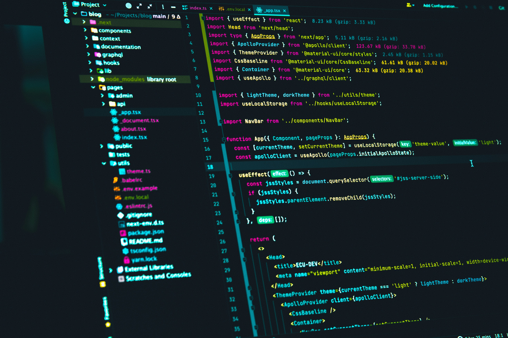

## 📸 Preview

---

## 🧠 Features

- Responsive navigation bar (Header)
- Hero section with call-to-action
- Services section with cards
- About section with images
- Social media integration
- Clean and modern UI design

---

## 🛠️ Technologies Used

- HTML5
- CSS3
- Font Awesome

---

## 📂 Project Structure

project/
│
├── index.html
├── css/
│ └── styles.css
└── assests/
├── images/
├── logo-1.svg
└── social icons

---

## 📌 Sections Included

- Header (Navigation + Social Media)
- Hero Section
- Trust / Features Section
- About Section
- Services Section

---

## ⚡ How to Run

1. Download or clone the repository  
2. Open `index.html` in your browser  

---

## 🎯 Purpose

This project was created to improve frontend development skills and practice building responsive layouts using HTML and CSS.

---

## 👨‍💻 Author

Emiliano Rivas  
Frontend Developer  

---

## 📬 Contact

GitHub: https://github.com/emi-web
Portfolio: https://emi-projects.netlify.app
